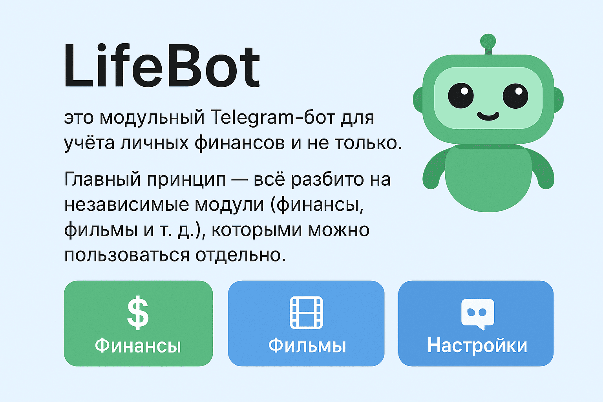

# 📊 LifeBot



---

## ✨ Возможности

### 🏦 Финансы

- Создание категорий расходов/доходов (например: "Еда", "Транспорт", "Зарплата").
- Возможность задать **лимиты** для категорий.
- Добавление операций (расход/доход).
- Просмотр статистики по категориям.
- 📑 **Админка** для управления категориями:
  - добавление;
  - изменение;
  - удаление;
  - сброс лимитов.

### 🎬 Фильмы _(в разработке)_

- Ведение списка просмотренных фильмов.
- Отметка фильмов, которые хотите посмотреть.
- Возможность ставить оценки просмотренным фильмам.

---

## ⚙️ Установка и запуск

### 1. Клонируйте репозиторий

```bash
git clone https://github.com/Aleksey512/LifeBot.git
cd LifeBot
```

### 2. Настройте переменные окружения

Скопируйте `.env.example` в `.env` и заполните токен Telegram-бота и другие настройки:

```bash
cp env.example .env
```

### 3. Запуск через Docker Compose

Убедитесь, что у вас есть `docker` и `docker-compose`.
Запускаем:

```bash
docker compose up --build -d
```

Бот будет использовать SQLite (`db.db`) как базу данных.

---

## 📂 Структура проекта

```
.
├── docker-compose.yaml   # Docker Compose конфиг
├── Dockerfile            # Dockerfile для сборки
├── src/                  # Основной код бота
│   ├── bot/              # Роутеры
│   ├── db/               # Модели и репозитории (SQLAlchemy)
│   ├── config/           # Конфиги и константы
│   ├── assets/img/       # Картинки для сообщений
│   ├── migrations/       # Alembic миграции
│   └── main.py           # Старт бота
```

---

## 🧩 Архитектура

- **Модули** — каждая функциональность бота оформлена как отдельный модуль (`balance`, `movies`, …).
- **FSM (Finite State Machine)** — используется для диалогов (например, при добавлении категорий).
- **SQLAlchemy + Alembic** — для работы с БД.
- **aiogram v3** — основа для работы с Telegram API.

---

## 🚀 Roadmap

- [x] Финансовый модуль с категориями, балансом и статистикой.
- [x] Админка для управления категориями.
- [ ] Модуль фильмов (список, статусы, рейтинги).
- [ ] Система плагинов для расширения (например, трекер привычек).

---

## 🤝 Вклад в проект

PR-ы и предложения приветствуются!
Для разработки используйте:

```bash
make lint   # линтеры
make lint   # mypy
make test   # тесты
```

---

## 📜 Лицензия

Проект распространяется под лицензией [MIT](./LICENSE).
